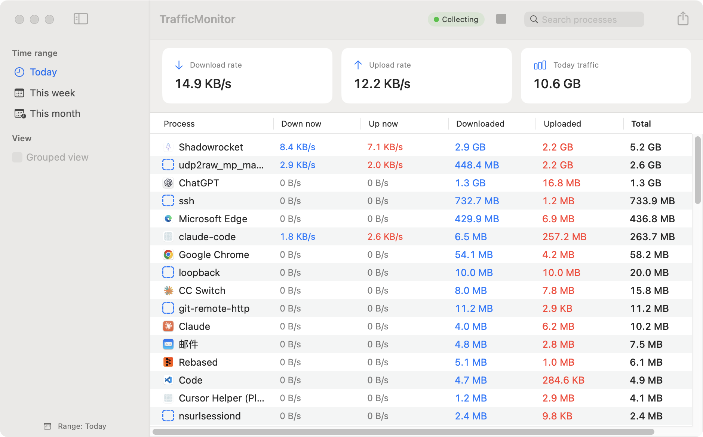
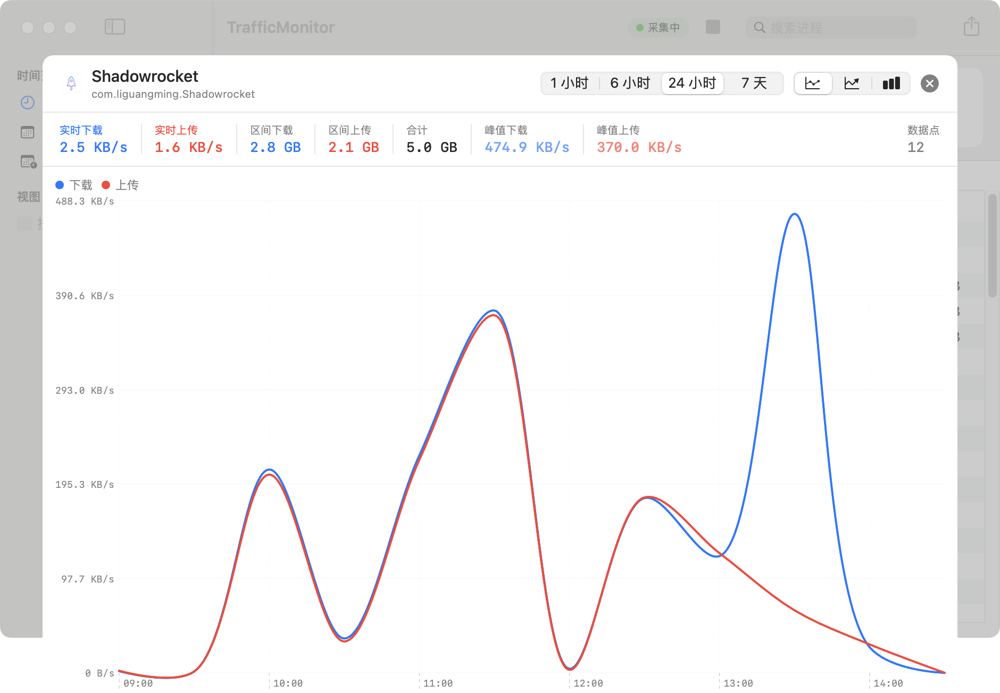

# TrafficMonitor

**Per-application network traffic monitoring for macOS — that still works behind a VPN or proxy.**

[](https://github.com/mo2g/traffic-monitoring/actions/workflows/ci.yml)
[](https://www.apple.com/macos/)
[](https://swift.org)
[](LICENSE)

English | [简体中文](README.zh-CN.md)



<details>
<summary>Per-process timeline</summary>



Switchable between a smoothed curve, a filled area and grouped bars, over 1 h / 6 h / 24 h / 7 d.

</details>

## Why this exists

When a proxy client such as Shadowrocket, Surge or Clash runs in VPN mode on macOS
(`NEPacketTunnelProvider`), every packet is routed through a `utun` interface before
leaving the machine. From that point on the originating process is no longer visible —
to the tunnel, *all* traffic looks like its own. Most per-app traffic tools, Little
Snitch included, lose attribution here.

The kernel, however, records which process opened a connection **before** the packet
reaches `utun`:

```
Chrome → connect()          ← kernel records: this socket belongs to Chrome
       → routing table → utun
       → proxy client       ← proxy sees only its own egress
       → internet

  NetworkStatistics reads at the kernel layer, above the tunnel  ✓
```

TrafficMonitor talks to that kernel subsystem directly (the same backend `nettop` and
Activity Monitor use), so it still reports *"Chrome downloaded 1.2 GB"* even when the
bytes physically left through the proxy.

## Features

- **Attribution that survives tunnels** — per-process, read from the kernel above `utun`
- **Aggregation by bundle identifier** — Chrome's dozens of helper processes collapse into one row
- **Menu bar mode** — live up/down rates on two lines, adjustable font size, with a panel listing the busiest apps
- **English and Simplified Chinese** — follows the system language, or pick one in Settings
- **Real application icons** — resolved from the process, exactly like Activity Monitor
- **Live rates and cumulative totals** — sortable native table, updated once per second
- **Per-process timeline chart** — smoothed line, area or bar, over 1 h / 6 h / 24 h / 7 d
- **Search and context menu** — filter by name; right-click to copy the bundle ID or reveal the binary in Finder
- **Custom groups** — roll several apps into one line
- **Threshold alerts** — by total bytes or by rate, delivered as system notifications (throttled to one per minute per rule)
- **Per-row trend sparkline** — optional, off by default
- **Launch at login**, **process exclusions**, **CSV export**
- **Local SQLite storage** — 60-second bucketing, automatic retention cleanup, and on-demand compaction that returns freed space to the disk
- **Light on resources** — ~1.4% of one CPU core, no root, no kernel extension, no entitlements

## Requirements

- macOS 14.0 (Sonoma) or later
- Swift 5.9 / Xcode 15 or later (to build)

No administrator privileges are required, at build time or at run time.

## Install

### Download

Grab the latest `.dmg` from [Releases](https://github.com/mo2g/traffic-monitoring/releases), open it
and drag the app to Applications. Builds are produced by GitHub Actions from a tagged
commit and carry a SHA-256 checksum in the release notes.

They are ad-hoc signed but **not notarized**, so on first launch macOS will block the
app — right-click → **Open**, or clear the quarantine flag:

```bash
xattr -dr com.apple.quarantine /Applications/TrafficMonitor.app
```

### Build from source

```bash
git clone https://github.com/mo2g/traffic-monitoring.git
cd REPO
Scripts/make-dmg.sh              # → dist/TrafficMonitor-<version>.dmg
```

Open the `.dmg` and drag the app to Applications. To skip the disk image and install
directly:

```bash
Scripts/make-app.sh /Applications
```

Both build a release binary and assemble `TrafficMonitor.app` with its icon.

> **Build the `.app`, don't just run the binary.** `swift build` alone produces a bare
> executable with no bundle identifier, and `UNUserNotificationCenter` refuses to work
> without one — threshold alerts silently do nothing. `Scripts/make-app.sh` generates a
> proper `Info.plist` and ad-hoc signs the bundle.

The first launch asks for **Notifications** permission; alerts need it.

### Build without packaging

```bash
swift build -c release && ./.build/release/TrafficMonitor
```

Everything works except alerts.

## Usage

Collection starts automatically when the window opens. The toolbar shows collector
status and a start/stop button.

| Where | What |
|---|---|
| Summary cards | Aggregate download / upload rate and total traffic |
| Table | Per-app live rates and cumulative totals — click a column header to sort, **double-click** a row for its timeline, right-click for more |
| Search | Filter by process name (`⌘F`) |
| Sidebar | Time range (today / this week / this month) and per-app vs grouped view |
| Menu bar | Live up/down rates on two lines (`1.2K/s↑` / `1.2M/s↓`); click for the busiest apps and quick actions |
| Timeline window | Switch chart style (curve / area / bar) and time range; both choices are remembered |
| Settings (`⌘,`) | Language, menu bar font size, sampling interval, flush interval, database size and cleanup, groups, alert rules, debug log |

The menu bar panel lists processes that had **any traffic in the last 30 seconds**,
ranked by smoothed rate, top six — not "whatever is transferring right this instant".
Rows sitting at zero are dimmed and drop off after 30 seconds of silence. Holding the
membership and the row count still is what stops the panel from jumping around while
you read it. See the [architecture notes](docs/architecture.md#9-菜单栏面板为什么要在快照之上再加一层行台账)
for the exact rule.

Data lives in `~/Library/Application Support/TrafficMonitor/traffic_monitor.db`.

## How it works

```
NetworkStatistics.framework   ← kernel NStat subsystem, polled every 2 s
        ↓  four fields per connection, read without CFDictionary bridging
NStatCollector + SourceLedger ← per-connection cumulative → per-PID delta
        ↓  AsyncStream (.bufferingNewest(1))
TrafficPipeline (actor)       ← identity resolution, aggregation, bucketing, alerts
        ↓  DashboardSnapshot, at most once per second, skipped when the window is hidden
DashboardViewModel (@Observable) → SwiftUI
```

Deltas are computed **per connection**, not per process: a connection's byte counter is
monotonic and the kernel drops it on close, so PID reuse and process exit need no
special handling.

See [docs/architecture.md](docs/architecture.md) for the full design and the reasoning
behind each decision.

## Performance

Steady state is **~1.4% of one CPU core** with the window in the background and roughly
340 live connections — down from 6.3% before a dedicated optimisation pass:

| | Before | After |
|---|---:|---:|
| Steady-state CPU | 6.3% | **1.4–1.7%** |
| Main-thread active samples (20 s @ 1 ms) | 975 | 112 |
| SQLite rows written per day | ~1.73 M | ~58 K |

[docs/performance.md](docs/performance.md) documents the measurement method, the
attribution experiments and every number above, including how to reproduce them.

## Privacy

Everything stays on your machine. Traffic counters are read from the local kernel and
written to a local SQLite file. The app makes no network requests of its own, contains
no analytics, and never transmits anything anywhere.

Recorded per app: display name, bundle identifier, byte counts, timestamps. **Not**
recorded: hostnames, IP addresses, ports, or any packet contents.

## Limitations

| Limitation | Detail |
|---|---|
| **Private API** | `NetworkStatistics.framework` is undocumented. This app therefore **cannot ship on the Mac App Store**, and a major macOS release could change or remove the symbols it relies on. Verified working on macOS 14.4. |
| **Loopback traffic is double counted** | When a process connects to itself over `127.0.0.1`, it is both endpoints, so the kernel records the payload once as sent and once as received. Measured: transferring 10 MiB yields rx = 10 MiB *and* tx = 10 MiB, making the "total" column 2× the real payload. Traffic to the internet is unaffected. |
| **Very short connections** | A connection opened and closed between two samples is dropped along with its source. |


## Roadmap

Known gaps, roughly in order of usefulness:

- Notarized, signed releases (builds are currently ad-hoc signed only)
- Per-app traffic quotas rather than one-shot alerts
- Export the timeline chart as an image

## Project layout

```
├── Package.swift
├── Sources/
│   ├── App/            Application entry point
│   ├── Core/
│   │   ├── Collector/  Kernel interface, delta ledger, service lifecycle
│   │   ├── TrafficPipeline.swift   All per-frame computation (actor)
│   │   └── DataStore.swift         SQLite via GRDB (actor)
│   ├── Models/         Value types crossing concurrency domains
│   ├── Utilities/      Constants, identity resolver, formatting, logging
│   ├── ViewModels/     DashboardViewModel, MenuBarRowLedger
│   └── Views/
├── Tests/
├── Resources/
│   └── AppIcon.icns    Generated by Scripts/make-icon.swift
├── Scripts/
│   ├── build.sh        Resolve, build, test
│   ├── make-app.sh     Assemble TrafficMonitor.app
│   ├── make-dmg.sh     Assemble a distributable .dmg
│   └── make-icon.swift Regenerate the app icon
└── docs/
    ├── architecture.md
    ├── performance.md
    └── research/       Phase-0 feasibility study (historical)
```

## Development

```bash
Scripts/build.sh     # resolve + build (release) + test
swift test           # tests only
```

129 tests cover the delta ledger, the pipeline (aggregation, rate reset, UI throttling,
visibility gating, time-range reload, process exclusion), models, formatting, chart
bucketing, the icon cache, the stores, SQLite round-trips, and the string tables —
including a check that every `L("…")` key used in the source exists in both languages. The
`NStatCollector` integration tests talk to the real kernel interface and skip
themselves when the machine has no network activity.

CI runs build, test and `.dmg` packaging on `macos-14` for every push and pull request,
and uploads the disk image as a build artifact.

`Constants.swift` is the single source of truth for the version and bundle identifier —
`make-app.sh` reads both out of it when generating `Info.plist`.

Localized strings live in `Sources/Resources/<lang>.lproj/Localizable.strings`. They are
declared with `.copy` rather than `.process` on purpose: `.process` lowercases
`zh-Hans.lproj` to `zh-hans.lproj`, after which the locale never matches at runtime and
everything silently falls back to English.

The package uses SwiftPM's flat single-target layout: sources sit directly in `Sources/`
and tests in `Tests/`, with no `path:` in the manifest. This is the shape
`swift package init --type executable` generates and is only valid while each of those
directories holds exactly one target — adding a second one requires moving sources under
`Sources/<TargetName>/`.

## License

[MIT](LICENSE)
