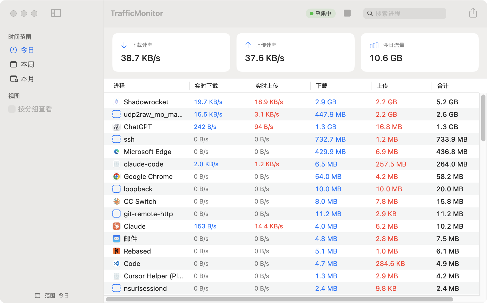

# TrafficMonitor

**macOS 上按应用统计网络流量 —— 在 VPN / 代理模式下依然准确。**

[](https://www.apple.com/macos/)
[](https://swift.org)
[](LICENSE)

[English](README.md) | 简体中文

<!--
截图放这里，例如：

-->

## 为什么需要它

Shadowrocket、Surge、Clash 这类代理客户端在 macOS 上以 VPN 模式运行时
（`NEPacketTunnelProvider`），所有流量都要先经过 `utun` 虚拟网卡才出机器。
从这一刻起，"是谁发起的连接"这个信息就丢了 —— 在隧道看来，**所有流量都是它自己产生的**。
市面上大多数按应用统计流量的工具（包括 Little Snitch）在这里都会失去归因能力。

但内核在数据包进入 `utun` **之前**，就已经记下了这个 socket 属于哪个进程：

```
Chrome → connect()          ← 内核在此记录：这条 socket 属于 Chrome
       → 路由表 → utun
       → 代理客户端          ← 代理只看得到自己的出站流量
       → 互联网

  NetworkStatistics 在内核层读取，位于隧道之上  ✓
```

TrafficMonitor 直接对接这个内核子系统（`nettop` 和「活动监视器」用的是同一个后端），
所以即使字节实际是从代理出去的，它依然能告诉你"Chrome 下载了 1.2 GB"。

## 功能

- **穿透隧道的归因** —— 按进程统计，在 `utun` 之上从内核读取
- **按 Bundle ID 聚合** —— Chrome 的几十个 helper 子进程合并成一行
- **真实应用图标** —— 从进程解析，与活动监视器一致
- **实时速率 + 累计流量** —— 原生表格，可点列头排序，每秒刷新
- **单进程时间线图表** —— 平滑曲线 / 面积 / 柱状三种样式，跨度 1 小时 / 6 小时 / 24 小时 / 7 天
- **搜索与右键菜单** —— 按名称过滤；右键可复制 Bundle ID、在访达中显示
- **自定义分组** —— 把多个应用归到一条
- **流量告警** —— 按总字节或速率设阈值，走系统通知（每条规则每分钟最多一次）
- **CSV 导出**
- **本地 SQLite 存储** —— 60 秒分桶，自动按保留期清理
- **资源占用低** —— 约 1.4% 单核 CPU，无需 root、无内核扩展、无特殊 entitlement

## 环境要求

- macOS 14.0 (Sonoma) 及以上
- Swift 5.9 / Xcode 15 及以上（仅编译需要）

编译和运行**都不需要管理员权限**。

## 安装

```bash
git clone https://github.com/OWNER/REPO.git
cd REPO
Scripts/make-dmg.sh              # → dist/TrafficMonitor-<版本>.dmg
```

打开 dmg，把应用拖进 Applications 即可。不想经过磁盘映像、直接安装：

```bash
Scripts/make-app.sh /Applications
```

两条命令都会编译 release 版本并组装出带图标的 `TrafficMonitor.app`。

> **务必打包成 `.app`，不要只跑裸二进制。** 单独 `swift build` 产出的可执行文件没有
> Bundle ID，而 `UNUserNotificationCenter` 要求调用方必须有 —— 告警功能会静默失效。
> `Scripts/make-app.sh` 会生成正确的 `Info.plist` 并做 ad-hoc 签名。

应用未做公证，首次打开会被 macOS 拦下。右键 → **打开**，或者清掉隔离属性：

```bash
xattr -dr com.apple.quarantine /Applications/TrafficMonitor.app
```

首次启动还会请求**通知**权限，告警功能需要它。

### 不打包直接运行

```bash
swift build -c release && ./.build/release/TrafficMonitor
```

除告警外功能都正常。

## 使用

窗口打开后自动开始采集，工具栏显示采集状态和启动/停止按钮。

| 位置 | 内容 |
|---|---|
| 汇总卡片 | 总下载 / 上传速率、总流量 |
| 表格 | 每个应用的实时速率与累计流量 —— 点列头排序，**双击**某行打开时间线，右键有更多操作 |
| 搜索 | 按进程名过滤（`⌘F`） |
| 侧栏 | 在「按应用」和「按分组」视图之间切换 |
| 时间线窗口 | 切换图表样式（曲线 / 面积 / 柱状）和时间跨度，两者都会被记住 |
| 设置（`⌘,`） | 采集间隔、落库间隔、数据库大小与清理、分组、告警规则、调试日志 |

数据保存在 `~/Library/Application Support/TrafficMonitor/traffic_monitor.db`。

## 工作原理

```
NetworkStatistics.framework   ← 内核 NStat 子系统，每 2 秒查询一次
        ↓  每条连接只读 4 个字段，不做 CFDictionary 整体桥接
NStatCollector + SourceLedger ← 每条连接的累计值 → 按 PID 的增量
        ↓  AsyncStream (.bufferingNewest(1))
TrafficPipeline (actor)       ← 身份解析、聚合、分桶、告警
        ↓  DashboardSnapshot，最快每秒一次，窗口被遮挡时直接跳过
DashboardViewModel (@Observable) → SwiftUI
```

差值是**按连接**算的，不是按进程：连接的字节计数器单调递增，关闭时内核直接移除它，
因此 PID 复用和进程退出都不需要任何特殊处理。

完整设计与每个决策的取舍见 [docs/architecture.md](docs/architecture.md)。

## 性能

窗口置于后台、约 340 条活跃连接时，稳态占用约 **1.4% 单核 CPU** —— 专项优化前是 6.3%：

| | 优化前 | 优化后 |
|---|---:|---:|
| 稳态 CPU | 6.3% | **1.4–1.7%** |
| 主线程活跃采样数（20 秒 @1ms） | 975 | 112 |
| 每天写入 SQLite 行数 | ~173 万 | ~5.8 万 |

[docs/performance.md](docs/performance.md) 记录了测量方法、归因实验和上面每一个数字，
包括如何复现。

## 隐私

所有数据都留在本机。流量计数从本地内核读取，写进本地 SQLite 文件。
应用自身不发起任何网络请求，不含任何统计埋点，不向任何地方传输数据。

会记录的：应用显示名、Bundle ID、字节数、时间戳。
**不会**记录：域名、IP 地址、端口，以及任何数据包内容。

## 限制

| 限制 | 说明 |
|---|---|
| **依赖私有 API** | `NetworkStatistics.framework` 未公开，因此本应用**无法上架 Mac App Store**，且 macOS 大版本升级可能改变或移除它依赖的符号。已在 macOS 14.4 上验证可用。 |
| **loopback 流量双记** | 进程通过 `127.0.0.1` 连自己时，它同时是收发两端，内核会把同一份数据各记一次发送和一次接收。实测：传输 10 MiB → rx = 10 MiB **且** tx = 10 MiB，"合计"列是实际载荷的 2 倍。真实外网流量不受影响。 |
| **极短连接** | 在两次采样之间建立又关闭的连接，会随 source 被移除而一并丢失。 |
| **统计窗口固定 24 小时** | 侧栏的「今日 / 本周 / 本月」目前只改标签，统计窗口硬编码为最近 24 小时。 |

## 后续计划

已知待补，大致按价值排序：

- 让「今日 / 本周 / 本月」真正重新查询数据库
- 接上设置里的「排除进程」输入框（目前不生效）
- 开机自启动
- 菜单栏模式，常驻显示实时速率
- 签名与公证的正式发布（目前只做 ad-hoc 签名）

## 目录结构

```
├── Package.swift
├── Sources/
│   ├── App/            应用入口
│   ├── Core/
│   │   ├── Collector/  内核接口、差值台账、采集生命周期
│   │   ├── TrafficPipeline.swift   所有逐帧计算（actor）
│   │   └── DataStore.swift         SQLite / GRDB（actor）
│   ├── Models/         跨并发域传递的值类型
│   ├── Utilities/      常量、身份解析、格式化、日志
│   ├── ViewModels/
│   └── Views/
├── Tests/
├── Resources/
│   └── AppIcon.icns    由 Scripts/make-icon.swift 生成
├── Scripts/
│   ├── build.sh        解析依赖 + 编译 + 测试
│   ├── make-app.sh     组装 TrafficMonitor.app
│   ├── make-dmg.sh     组装可分发的 .dmg
│   └── make-icon.swift 重新生成应用图标
└── docs/
    ├── architecture.md
    ├── performance.md
    └── research/       Phase 0 可行性预研（历史存档）
```

## 开发

```bash
Scripts/build.sh     # 解析依赖 + 编译 release + 测试
swift test           # 只跑测试
```

97 个测试覆盖差值台账、管线（聚合、速率归零、UI 节流、可见性闸门）、模型、格式化、
图表分桶、图标缓存、偏好存储和 SQLite 读写往返。`NStatCollector` 的集成测试直连真实内核接口，
机器无网络活动时会自动跳过。

CI 在 `macos-14` 上对每次 push 和 PR 执行编译、测试和 `.dmg` 打包，并把磁盘映像
作为构建产物上传。

`Constants.swift` 是版本号和 Bundle ID 的唯一真源 —— `make-app.sh` 生成 `Info.plist`
时从那里读取。

包采用 SwiftPM 的单目标扁平布局：源码直接放在 `Sources/`、测试直接放在 `Tests/`，
清单里不写 `path:`。这正是 `swift package init --type executable` 生成的形态，
但它只在这两个目录各自**只有一个目标**时成立 —— 将来若新增第二个目标，
必须把源码移进 `Sources/<目标名>/`。

## 许可证

[MIT](LICENSE)
